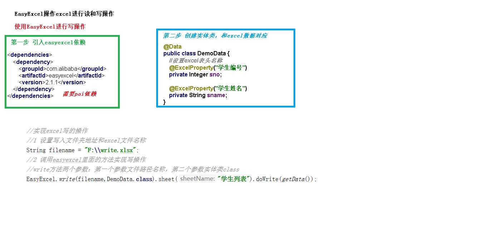

# EasyExcel读写Excel的基本使用

[EasyExcel读写Excel的基本使用](../doc/day06/day06项目【整合阿里云OSS和Excel导入分类】/2-EasyExcel导入课程分类/01-EasyExcel读写Excel的基本使用.ziw)

[Excel写](../doc/day06/day06项目【整合阿里云OSS和Excel导入分类】/2-EasyExcel导入课程分类/02-Excel写.ziw)

[Excel读](../doc/day06/day06项目【整合阿里云OSS和Excel导入分类】/2-EasyExcel导入课程分类/03-Excel读.ziw)