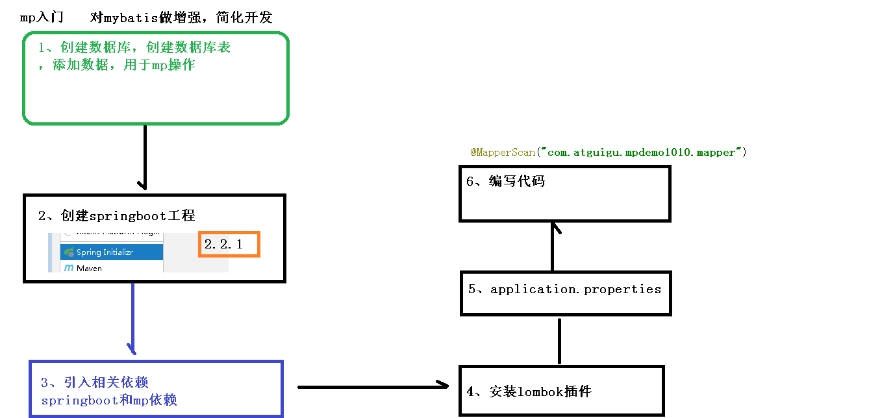

# MyBatisPlus 入门案例

1. 创建并初始化数据库
2. 初始化 Spring Boot 工程
3. 添加依赖
4. application.properties 配置文件中添加 MySQL 数据库的相关配置
5. 编写代码
   1. 创建实体类
   2. 创建 Mapper 接口继承 BaseMapper
   3. Spring Boot 启动类中添加 @MapperScan 注解，扫描 Mapper 文件夹
6. 开始使用，在测试类中测试
7. 在配置文件中开启 mybatis-plus 日志

[MyBatisPlus 简介](./doc/01-MyBatisPlus简介.ziw)

[MyBatisPlus 入门](./doc/02-MyBatisPlus入门.ziw)

