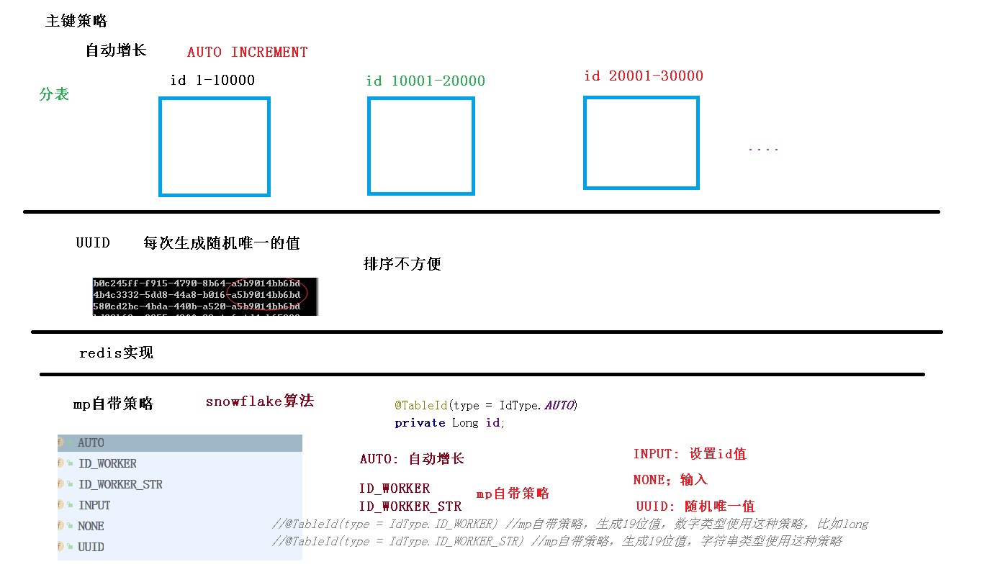
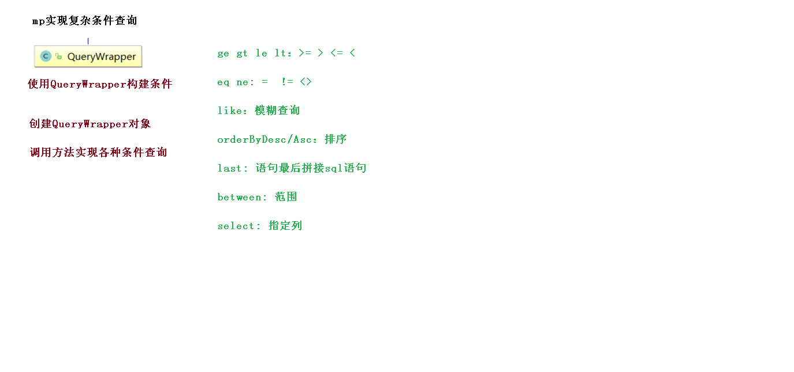

# MyBatisPlus 入门案例

1. 插入
   1. userMapper.insert(user);
   2. 主键生成策略
2. 更新
   1. userMapper.updateById(user);
   2. 自动填充
   3. 乐观锁
3. 查询
   1. userMapper.selectById(1L);
   2. userMapper.selectBatchIds(Arrays.asList(1, 2, 3));
   3. userMapper.selectByMap(map); // 通过 map 封装查询条件
   4. userMapper.selectPage(page, null); // 分页
4. 删除
   1. userMapper.deleteById(8L);
   2. userMapper.deleteBatchIds(Arrays.asList(8, 9, 10));
   3. userMapper.deleteByMap(map);
   4. 逻辑删除
5. 性能分析
6. 复杂查询（QueryWrapper）

[MyBatisPlus 的 CRUD 接口](doc/03-MyBatisPlus的CRUD接口.ziw)

[MyBatisPlus 条件构造器](doc/04-MyBatisPlus条件构造器.ziw)

