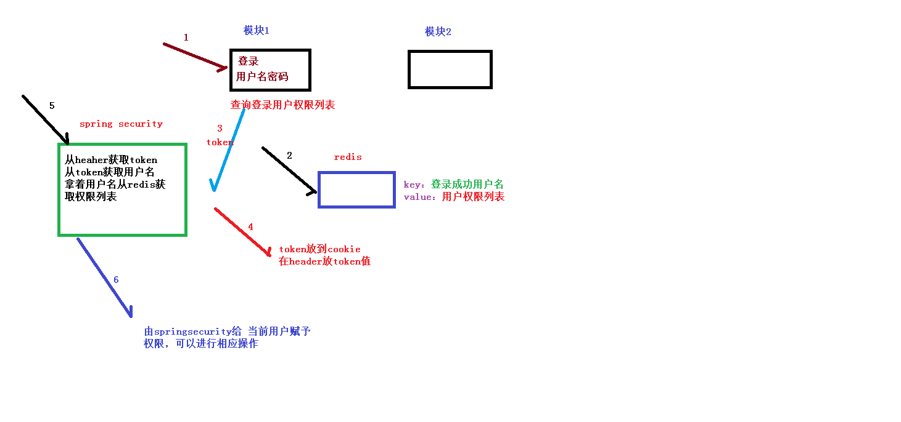
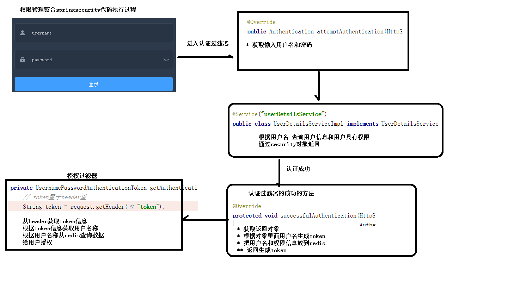
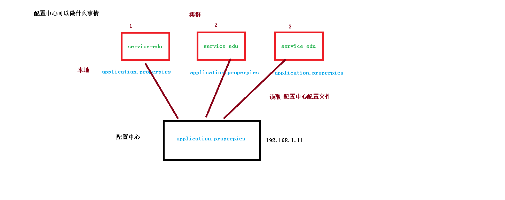
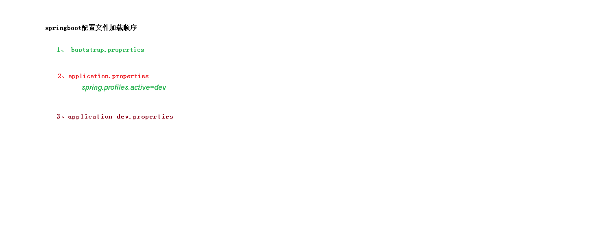

# 权限管理、配置中心、Git

[day18在线教育项目课堂笔记](../../doc/day18/day18随堂笔记/day18在线教育项目课堂笔记.docx)

[整合Spring-Security](../../doc/day18/day18项目【权限管理和配置服务】/1-整合Spring-Security)

[Nacos配置中心](../../doc/day18/day18项目【权限管理和配置服务】/2-Nacos配置中心)