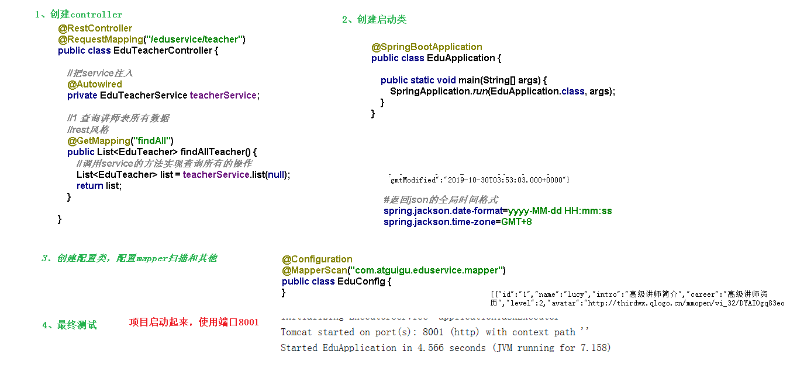

# 讲师管理模块配置、编写后台管理api接口

1. 讲师管理模块配置
   1. 在service下面的service-edu模块中创建配置文件
   2. 创建MP代码生成器
2. 编写后台管理api接口
   1. 编写controller代码
   2. 创建SpringBoot启动类
   3. 创建SpringBoot配置类
   4. 运行启动类
   5. 配置SQL执行性能分析插件（OP）
   6. 统一返回的json时间格式（OP）

[讲师管理模块配置和生成代码](../../doc/day02/day02项目【环境搭建和讲师管理接口开发】/2-讲师管理接口开发/01-讲师管理模块配置和生成代码.ziw)