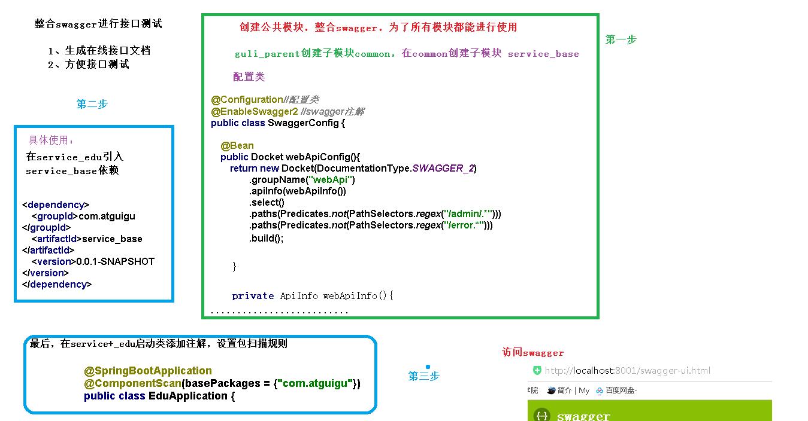

# 讲师逻辑删除功能

1. 实现逻辑删除
   1. 配置逻辑删除插件
   2. 添加 @TableLogic
   3. EduTeacherController添加删除方法
   4. 使用postman测试删除
2. 使用 swagger 测试
   1. 创建common模块
   2. 在common中引入相关依赖
   3. 在common下面创建子模块service-base
   4. 在模块service-base中，创建swagger的配置类
   5. 在模块service模块中引入service-base
   6. 在service-edu启动类上添加 ComponentScan(basePackages = "com.zhangmingge") 注解，设置扫描规则
   7. http://localhost:8001/swagger-ui.html 进行测试
   8. 定义接口说明和参数说明

[讲师管理模块配置和生成代码](../../doc/day02/day02项目【环境搭建和讲师管理接口开发】/2-讲师管理接口开发/01-讲师管理模块配置和生成代码.ziw)

[配置Swagger2生成API接口文档](../../doc/day02/day02项目【环境搭建和讲师管理接口开发】/2-讲师管理接口开发/02-配置Swagger2生成API接口文档.ziw)