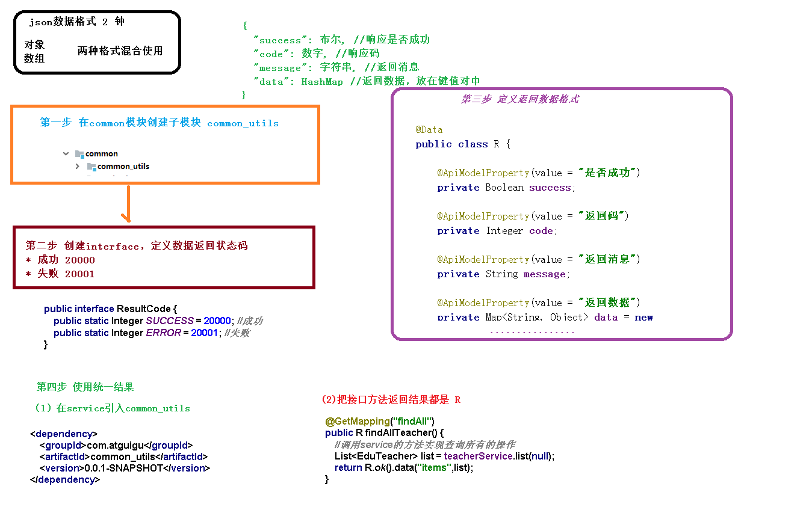

# 统一返回结果对象

1. 统一返回数据格式
2. 创建统一结果返回类
   1. 在common模块下创建子模块common-utils
   2. 创建接口定义返回码
   3. 创建结果类
3. 统一返回结果使用
   1. 在service模块中添加依赖
   2. 修改Controller中的返回结果

[统一返回结果对象](../../doc/day02/day02项目【环境搭建和讲师管理接口开发】/2-讲师管理接口开发/03-统一返回结果对象.ziw)