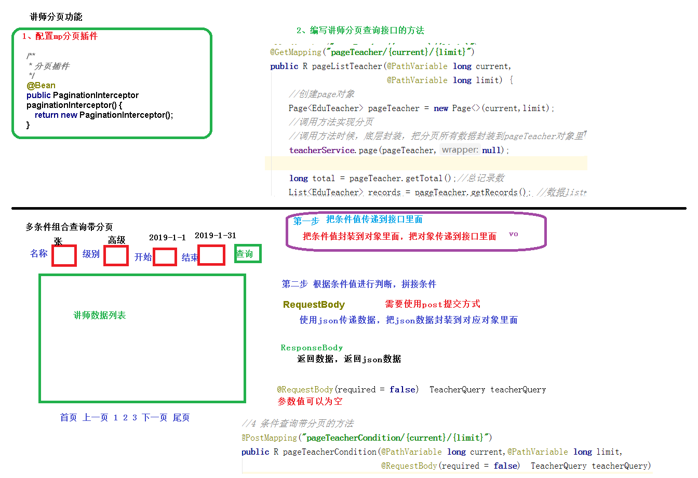

# 分页和条件查询接口开发

1. 分页
   1. 配置分页插件
   2. 分页Controller方法
   3. Swagger中测试
2. 条件查询
   1. 创建查询对象
   2. 编写 controller
   3. 编写 service
   4. Swagger 中测试

[分页和条件查询接口开发](../../doc/day02/day02项目【环境搭建和讲师管理接口开发】/2-讲师管理接口开发/04-分页和条件查询接口开发.ziw)