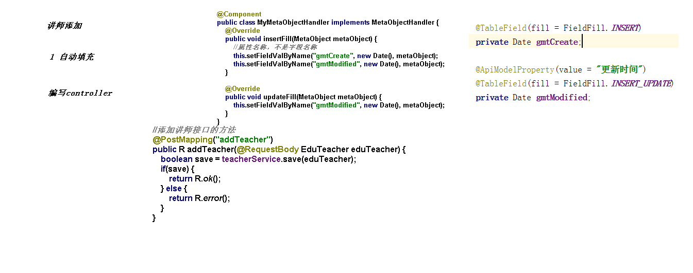
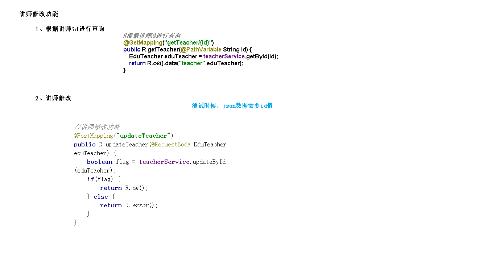

# 分页和条件查询接口开发

1. 自动填充封装
   1. 在实体类添加自动填充注解
      1. @TableField(fill = FieldFill.INSERT)
      2. @TableField(fill = FieldFill.INSERT_UPDATE)
   2. 在service-base模块编写自动填充代码（MyMetaObjectHandler）
2. controller方法定义
   1. 新增
   2. 修改
      1. 根据id查询
      2. 根据id修改

[新增和修改讲师接口开发](../../doc/day02/day02项目【环境搭建和讲师管理接口开发】/2-讲师管理接口开发/05-新增和修改讲师接口开发.ziw)