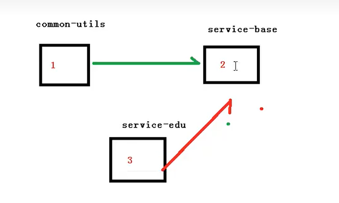
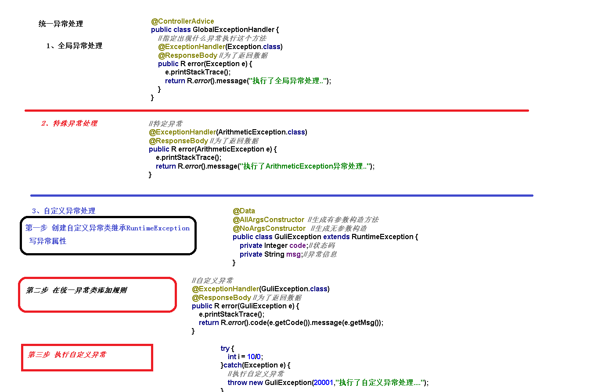

# 统一异常处理

1. 统一异常处理
   1. 全局异常处理
      1. 创建统一异常处理器：@ExceptionHandler(Exception.class)
      2. 测试
   2. 特定异常处理、
      1. 添加异常处理方法：@ExceptionHandler(ArithmeticException.class)
      2. 测试
   3. 自定义异常处理
      1. 创建自定义异常类
      2. 业务中需要的位置抛出 GuliException
      3. 添加异常处理方法：@ExceptionHandler(GuliException.class)
      4. 测试

[统一异常处理](../../doc/day02/day02项目【环境搭建和讲师管理接口开发】/2-讲师管理接口开发/07-统一异常处理.ziw)