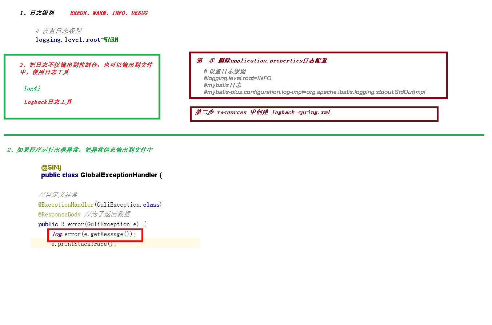

# 统一日志处理

1. 设置日志级别
   1. logging.level.root=WARN
2. 使用 Logback
   1. 删除原日志配置
   2. 配置logback日志：resources 中创建 logback-spring.xml
   3. 测试
   4. 将错误日志输出到文件
      1. 统一日志处理类上加 @Slf4j
      2. 异常处理代码中加上 log.error(e.getMessage());
   5. 将日志堆栈信息输出到文件
      1. 创建 ExceptionUtil
      2. 异常处理代码中加上 log.error(ExceptionUtil.getMessage(e));

[统一日志处理](../../doc/day02/day02项目【环境搭建和讲师管理接口开发】/2-讲师管理接口开发/08-统一日志处理.ziw)