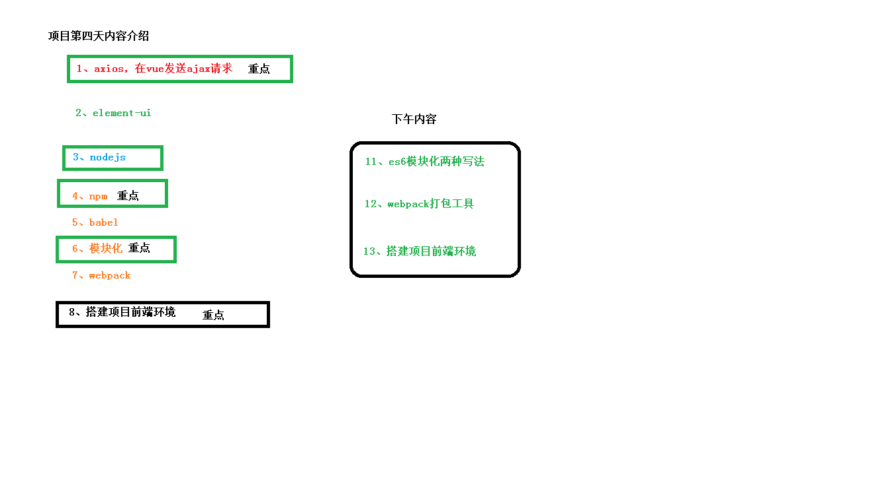
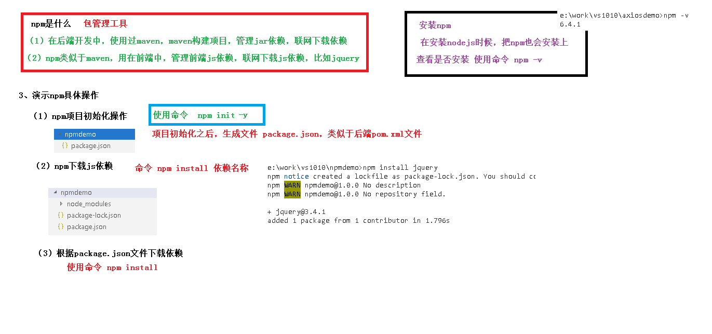

# Node

[Node](../../doc/day03/day03项目【项目前端相关基础知识一】/05-Node.ziw)

# npm

[NPM包管理器](../../doc/day04/day04项目【项目前端相关基础知识二】/06-NPM包管理器.ziw)

# babel

[Babel](../../doc/day04/day04项目【项目前端相关基础知识二】/07-Babel.ziw)