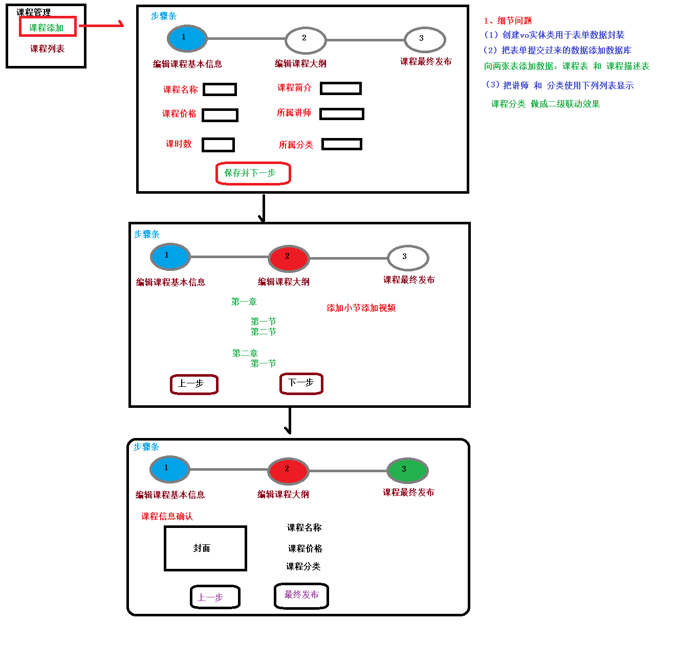
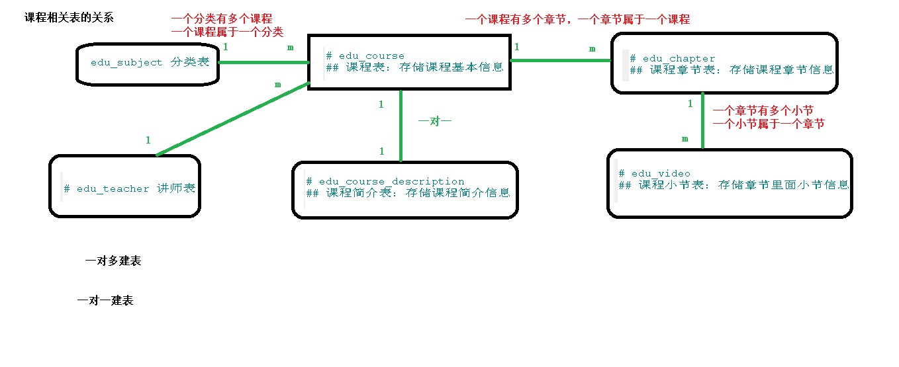
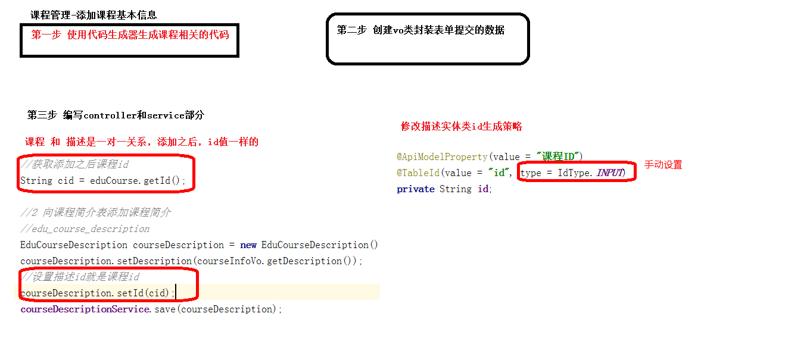
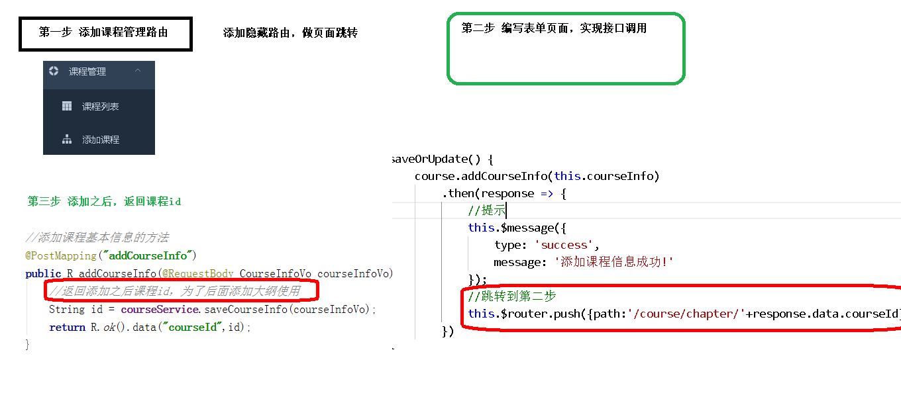
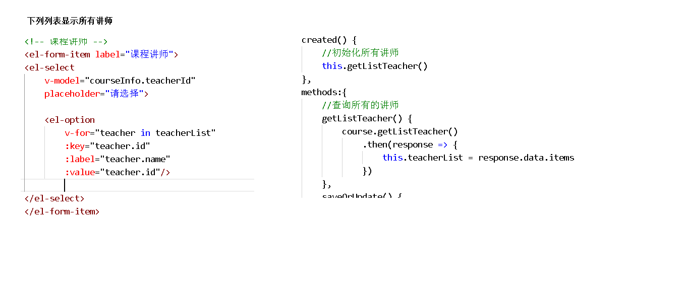
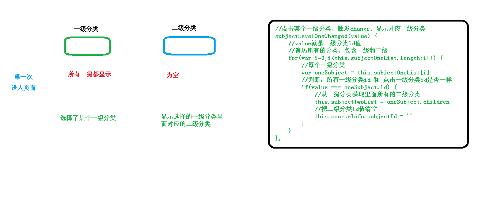

# 课程管理1

[课程发布表单-步骤导航](../../doc/day07/day07项目【课程发布-添加课程信息】/01-课程发布表单-步骤导航.ziw)

[编辑课程基本信息](../../doc/day07/day07项目【课程发布-添加课程信息】/02-编辑课程基本信息.ziw)

[课程分类多级联动的实现](../../doc/day07/day07项目【课程发布-添加课程信息】/03-课程分类多级联动的实现.ziw)

[讲师下拉列表](../../doc/day07/day07项目【课程发布-添加课程信息】/04-讲师下拉列表.ziw)

[课程封面](../../doc/day07/day07项目【课程发布-添加课程信息】/06-课程封面.ziw)