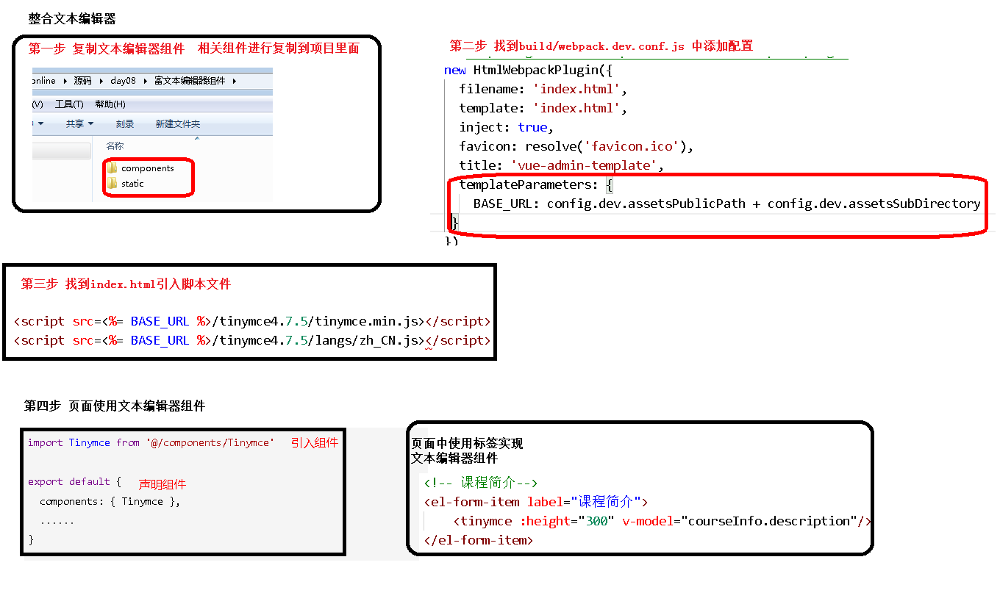

# 课程管理2

[富文本编辑器Tinymce](../../doc/day07/day07项目【课程发布-添加课程信息】/05-富文本编辑器Tinymce.ziw)

[课程大纲列表和章节管理](../../doc/day08/day08【课程发布-课程大纲和课程发布】/1-课程大纲列表和章节管理)

[课程信息回显](../../doc/day07/day07项目【课程发布-添加课程信息】/07-课程信息回显.ziw)

[更新课程信息](../../doc/day07/day07项目【课程发布-添加课程信息】/08-更新课程信息.ziw)

[课时（小节）管理](../../doc/day08/day08【课程发布-课程大纲和课程发布】/2-课时（小节）管理)

[课程最终发布](../../doc/day08/day08【课程发布-课程大纲和课程发布】/3-课程最终发布)