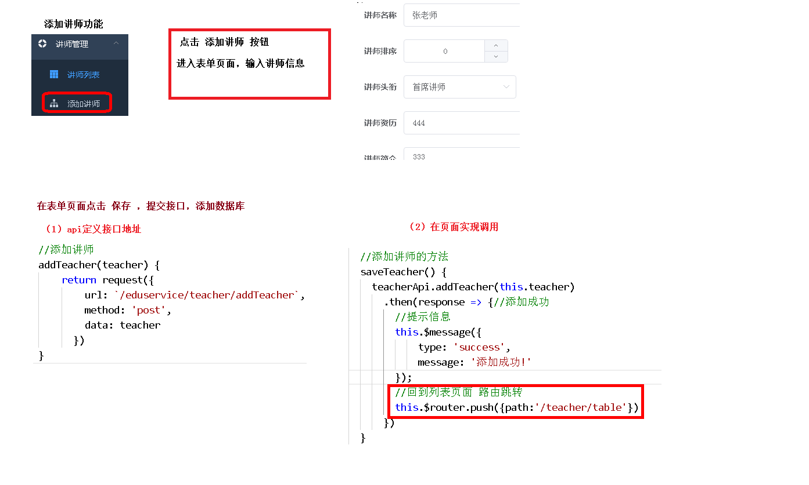

# 讲师列表-查询-删除

[项目中的路由](../doc/day05/day05项目【讲师管理模块前端开发】/01-项目中的路由.ziw)

[讲师管理列表组件（查询-删除）](../doc/day05/day05项目【讲师管理模块前端开发】/03-讲师管理列表组件（查询-删除）.ziw)

# 讲师列表-添加-修改

[讲师管理表单组件（添加-修改）](../doc/day05/day05项目【讲师管理模块前端开发】/04-讲师管理表单组件（添加-修改）.ziw)